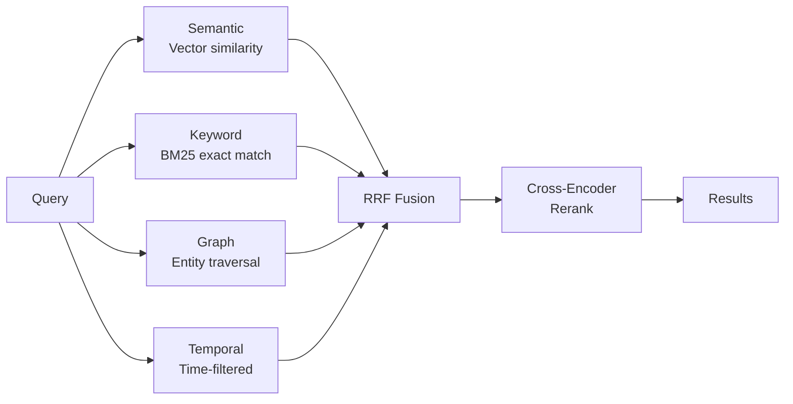

# Search Facts

Retrieve memories using multi-strategy search.

import Tabs from '@theme/Tabs';
import TabItem from '@theme/TabItem';

## Basic Search

<Tabs>
<TabItem value="python" label="Python">

```python
from hindsight_client import Hindsight

client = Hindsight(base_url="http://localhost:8888")

results = client.recall(
    bank_id="my-bank",
    query="What does Alice do?"
)

for r in results:
    print(f"{r['text']} (score: {r['weight']:.2f})")
```

</TabItem>
<TabItem value="node" label="Node.js">

```typescript
import { HindsightClient } from '@hindsight/client';

const client = new HindsightClient({ baseUrl: 'http://localhost:8888' });

const results = await client.recall('my-bank', 'What does Alice do?');

for (const r of results) {
    console.log(`${r.text} (score: ${r.weight})`);
}
```

</TabItem>
<TabItem value="cli" label="CLI">

```bash
hindsight memory search my-bank "What does Alice do?"
```

</TabItem>
</Tabs>

## Search Parameters

| Parameter | Type | Default | Description |
|-----------|------|---------|-------------|
| `query` | string | required | Natural language query |
| `types` | list | all | Filter: `world`, `agent`, `opinion` |
| `budget` | string | "mid" | Budget level: "low", "mid", "high" |
| `max_tokens` | int | 4096 | Token budget for results |

<Tabs>
<TabItem value="python" label="Python">

```python
results = client.recall(
    bank_id="my-bank",
    query="What does Alice do?",
    types=["world", "agent"],
    budget="high",
    max_tokens=8000
)
```

</TabItem>
<TabItem value="node" label="Node.js">

```typescript
const results = await client.recall('my-bank', 'What does Alice do?', {
    budget: 'high',
    maxTokens: 8000
});
```

</TabItem>
</Tabs>

## Full-Featured Search

For more control, use the full-featured recall method:

<Tabs>
<TabItem value="python" label="Python">

```python
# Full response with trace info
response = client.recall_memories(
    bank_id="my-bank",
    query="What does Alice do?",
    types=["world", "agent"],
    budget="high",
    max_tokens=8000,
    trace=True,
    include_entities=True,
    max_entity_tokens=500
)

# Access results
for r in response["results"]:
    print(f"{r['text']} (score: {r['weight']:.2f})")

# Access entity observations (if include_entities=True)
if "entities" in response:
    for entity in response["entities"]:
        print(f"Entity: {entity['name']}")
```

</TabItem>
<TabItem value="node" label="Node.js">

```typescript
// Full response with trace info
const response = await client.recallMemories('my-bank', {
    query: 'What does Alice do?',
    types: ['world', 'agent'],
    budget: 'high',
    maxTokens: 8000,
    trace: true
});

// Access results
for (const r of response.results) {
    console.log(`${r.text} (score: ${r.weight})`);
}
```

</TabItem>
</Tabs>

## Temporal Queries

Hindsight automatically detects time expressions and activates temporal search:

<Tabs>
<TabItem value="python" label="Python">

```python
# These queries activate temporal-graph retrieval
results = client.recall(bank_id="my-bank", query="What did Alice do last spring?")
results = client.recall(bank_id="my-bank", query="What happened in June?")
results = client.recall(bank_id="my-bank", query="Events from last year")
```

</TabItem>
<TabItem value="cli" label="CLI">

```bash
hindsight memory search my-bank "What did Alice do last spring?"
hindsight memory search my-bank "What happened between March and May?"
```

</TabItem>
</Tabs>

Supported temporal expressions:

| Expression | Parsed As |
|------------|-----------|
| "last spring" | March 1 - May 31 (previous year) |
| "in June" | June 1-30 (current/nearest year) |
| "last year" | Jan 1 - Dec 31 (previous year) |
| "last week" | 7 days ago - today |
| "between March and May" | March 1 - May 31 |

## Filter by Fact Type

Search specific memory networks:

<Tabs>
<TabItem value="python" label="Python">

```python
# Only world facts (objective information)
world_facts = client.recall(
    bank_id="my-bank",
    query="Where does Alice work?",
    types=["world"]
)

# Only agent facts (memory bank's own experiences)
agent_facts = client.recall(
    bank_id="my-bank",
    query="What have I recommended?",
    types=["agent"]
)

# Only opinions (formed beliefs)
opinions = client.recall(
    bank_id="my-bank",
    query="What do I think about Python?",
    types=["opinion"]
)

# World and agent facts (exclude opinions)
facts = client.recall(
    bank_id="my-bank",
    query="What happened?",
    types=["world", "agent"]
)
```

</TabItem>
<TabItem value="cli" label="CLI">

```bash
hindsight memory search my-bank "Python" --fact-type opinion
hindsight memory search my-bank "Alice" --fact-type world,agent
```

</TabItem>
</Tabs>

## How Search Works

Search runs four strategies in parallel:



| Strategy | When it helps |
|----------|---------------|
| **Semantic** | Conceptual matches, paraphrasing |
| **Keyword** | Names, technical terms, exact phrases |
| **Graph** | Related entities, indirect connections |
| **Temporal** | "last spring", "in June", time ranges |

## Response Format

```python
{
    "results": [
        {
            "id": "550e8400-e29b-41d4-a716-446655440000",
            "text": "Alice works at Google as a software engineer",
            "context": "career discussion",
            "event_date": "2024-01-15T10:00:00Z",
            "weight": 0.95,
            "fact_type": "world"
        }
    ]
}
```

| Field | Description |
|-------|-------------|
| `id` | Unique memory ID |
| `text` | Memory content |
| `context` | Original context (if provided) |
| `event_date` | When the event occurred |
| `weight` | Relevance score (0-1) |
| `fact_type` | `world`, `agent`, or `opinion` |

## Budget Levels

The `budget` parameter controls graph traversal depth:

- **"low" (100 nodes)**: Fast, shallow search — good for simple lookups
- **"mid" (300 nodes)**: Balanced — default for most queries
- **"high" (600 nodes)**: Deep exploration — finds indirect connections

<Tabs>
<TabItem value="python" label="Python">

```python
# Quick lookup
results = client.recall(bank_id="my-bank", query="Alice's email", budget="low")

# Deep exploration
results = client.recall(bank_id="my-bank", query="How are Alice and Bob connected?", budget="high")
```

</TabItem>
<TabItem value="node" label="Node.js">

```typescript
// Quick lookup
const results = await client.recall('my-bank', "Alice's email", { budget: 'low' });

// Deep exploration
const deep = await client.recall('my-bank', 'How are Alice and Bob connected?', { budget: 'high' });
```

</TabItem>
</Tabs>
