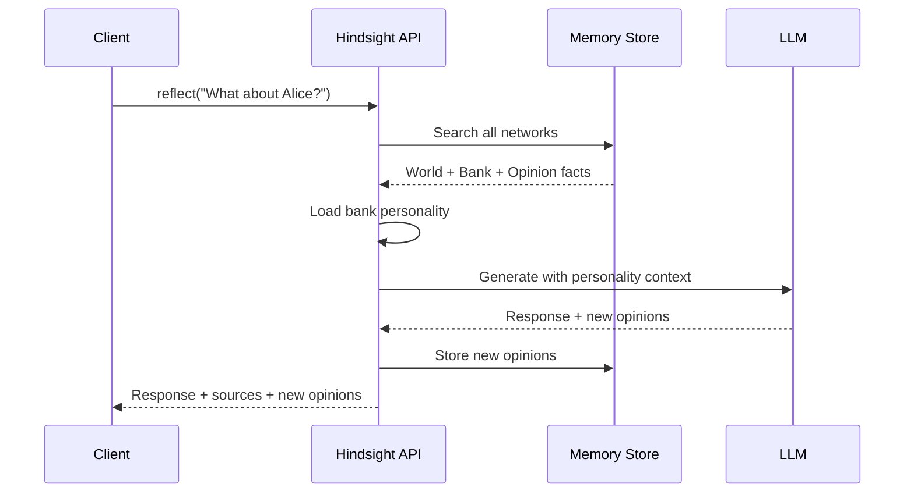

# Reflect

Generate personality-aware responses using retrieved memories.

import Tabs from '@theme/Tabs';
import TabItem from '@theme/TabItem';

## Basic Usage

<Tabs>
<TabItem value="python" label="Python">

```python
from hindsight_client import Hindsight

client = Hindsight(base_url="http://localhost:8888")

response = client.reflect(
    bank_id="my-bank",
    query="What should I know about Alice?"
)

print(response["answer"])
```

</TabItem>
<TabItem value="node" label="Node.js">

```typescript
import { HindsightClient } from '@hindsight/client';

const client = new HindsightClient({ baseUrl: 'http://localhost:8888' });

const response = await client.reflect('my-bank', 'What should I know about Alice?');

console.log(response.answer);
```

</TabItem>
<TabItem value="cli" label="CLI">

```bash
hindsight memory think my-bank "What should I know about Alice?"

# Verbose output shows reasoning and sources
hindsight memory think my-bank "What should I know about Alice?" -v
```

</TabItem>
</Tabs>

## Response Format

```python
{
    "answer": "Alice is a software engineer at Google who joined last year...",
    "facts_used": [
        {"text": "Alice works at Google", "weight": 0.95, "id": "..."},
        {"text": "Alice is very competent", "weight": 0.82, "id": "..."}
    ],
    "new_opinions": [
        {"text": "Alice would be good for the ML project", "id": "..."}
    ]
}
```

| Field | Description |
|-------|-------------|
| `answer` | Generated response |
| `facts_used` | Memories used in generation |
| `new_opinions` | New opinions formed during reasoning |

## Parameters

| Parameter | Type | Default | Description |
|-----------|------|---------|-------------|
| `query` | string | required | Question or prompt |
| `budget` | string | "low" | Budget level: "low", "mid", "high" |
| `context` | string | None | Additional context for the query |

<Tabs>
<TabItem value="python" label="Python">

```python
response = client.reflect(
    bank_id="my-bank",
    query="What do you think about remote work?",
    budget="mid",
    context="We're considering a hybrid work policy"
)
```

</TabItem>
<TabItem value="node" label="Node.js">

```typescript
const response = await client.reflect('my-bank', 'What do you think about remote work?', {
    budget: 'mid',
    context: "We're considering a hybrid work policy"
});
```

</TabItem>
</Tabs>

## What Reflect Does



1. **Retrieves** relevant memories from all three networks
2. **Loads** bank personality (Big Five traits + background)
3. **Generates** response influenced by personality
4. **Forms opinions** if the query warrants it
5. **Returns** response with sources and any new opinions

## Opinion Formation

Reflect can form new opinions based on evidence:

<Tabs>
<TabItem value="python" label="Python">

```python
response = client.reflect(
    bank_id="my-bank",
    query="What do you think about Python vs JavaScript for data science?"
)

# Response might include:
# answer: "Based on what I know about data science workflows..."
# new_opinions: [
#     {"text": "Python is better for data science", "id": "..."}
# ]
```

</TabItem>
</Tabs>

New opinions are automatically stored and influence future responses.

## Personality Influence

The bank's personality affects reflect responses:

| Trait | Effect on Reflect |
|-------|-----------------|
| High **Openness** | More willing to consider new ideas |
| High **Conscientiousness** | More structured, methodical responses |
| High **Extraversion** | More collaborative suggestions |
| High **Agreeableness** | More diplomatic, harmony-seeking |
| High **Neuroticism** | More risk-aware, cautious |

<Tabs>
<TabItem value="python" label="Python">

```python
# Create a bank with specific personality
client.create_bank(
    bank_id="cautious-advisor",
    background="I am a risk-aware financial advisor",
    personality={
        "openness": 0.3,
        "conscientiousness": 0.9,
        "neuroticism": 0.8,
        "bias_strength": 0.7
    }
)

# Reflect responses will reflect this personality
response = client.reflect(
    bank_id="cautious-advisor",
    query="Should I invest in crypto?"
)
# Response will likely emphasize risks and caution
```

</TabItem>
<TabItem value="node" label="Node.js">

```typescript
// Create a bank with specific personality
await client.createBank('cautious-advisor', {
    background: 'I am a risk-aware financial advisor',
    personality: {
        openness: 0.3,
        conscientiousness: 0.9,
        neuroticism: 0.8,
        bias_strength: 0.7
    }
});

// Reflect responses will reflect this personality
const response = await client.reflect('cautious-advisor', 'Should I invest in crypto?');
```

</TabItem>
</Tabs>

## Using Sources

The `facts_used` field shows which memories informed the response:

<Tabs>
<TabItem value="python" label="Python">

```python
response = client.reflect(bank_id="my-bank", query="Tell me about Alice")

print("Response:", response["answer"])
print("\nBased on:")
for fact in response.get("facts_used", []):
    print(f"  - {fact['text']} (relevance: {fact['weight']:.2f})")
```

</TabItem>
<TabItem value="node" label="Node.js">

```typescript
const response = await client.reflect('my-bank', 'Tell me about Alice');

console.log('Response:', response.answer);
console.log('\nBased on:');
for (const fact of response.facts_used || []) {
    console.log(`  - ${fact.text} (relevance: ${fact.weight.toFixed(2)})`);
}
```

</TabItem>
</Tabs>

This enables:
- **Transparency** — users see why the bank said something
- **Verification** — check if the response is grounded in facts
- **Debugging** — understand retrieval quality
